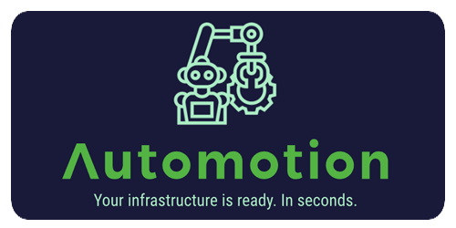

# Protein DevOps Engineer Bootcamp

## Final Project

**_Built with;_**

[![alpine][#alpine]][@alpine] [![sh][#sh]][@sh] [![Vagrant][#vagrant]][@vagrant] [![gitlab][#gitlab]][@gl-pipeline] [![gh-actions][#gh-actions]][@gh-actions] [![react][#react]][@react] [![docker][#docker]][@docker] [![terraform][#terraform]][@terraform] [![aws][#aws]][@aws] [![kubernetes][#kubernetes]][@kubernetes]

### :notebook: About

This repository contains the final project developed under the [Patika.dev][@patika] & [Protein][@protein] DevOps Engineer Bootcamp. While some directories are isolated developments, the overall purpose of the project is deploying a containerized application on optimized AWS infrastructure with the ability of Terraform using Gitlab CI/CD pipelines.

If you are looking for something specific, check out the [directory content](#open_file_folder-directory-content-) first!

### :open_book: **Table of Contents**

1. [Assignment](#hash-assignment-)
   - [Essential Tasks](#ballot_box_with_check-essential-tasks)
   - [Optional Tasks](#asterisk-optional-tasks)
2. [Overview](#notebook_with_decorative_cover-overview-)
3. [Featured](#sparkles-featured-)
4. [Project Board](#date-project-board-)
5. [Project Workflow](#twisted_rightwards_arrows-project-workflow-)
6. [AWS Infrastructure](#electric_plug-aws-infrastructure-)
   - [Infrastructure Visualization](#infrastructure-visualization)
7. [Directory Content](#open_file_folder-directory-content-)

### :hash: **Assignment** [🔝][@jump-to-top]

> Fully cover the DevOps cycle and create a full-on CI/CD and cloud infrastructure.

#### :ballot_box_with_check: **Essential Tasks**

> 1. Create a simple React application.
> 2. Containerize the image with the smallest possible size.
> 3. Design a Gitlab CI/CD pipeline to automate all processes.
> 4. Create the ideal VPC and implement security measures.
> 5. Create an Application Load Balancer in front of the service.
> 6. Deploy Docker image on ECS Fargate.
> 7. Deploy the application on Kubernetes.
> 8. Describe strategies and choices on related files.

#### :asterisk: **Optional Tasks**

> 1. Configure an auto-scaling on the ECS service.
> 2. Create a Cloudwatch dashboard with proper metrics.
> 3. Draw the AWS infrastructure and describe the relations between services.
> 4. Configure a self-hosted runner on Gitlab and share its configuration with the implementation steps.
> 5. Create a script that sends an email if the disk usage of the system exceeds 90% in the OS.

### :notebook_with_decorative_cover: **Overview** [🔝][@jump-to-top]

The project presents an example of a fully automated DevOps CI/CD cycle with the ability to deploy on AWS infrastructure. Check out the featured section for a quick preview of the project features.

<p align="center"></a></p>

### :sparkles: **Featured** [🔝][@jump-to-top]

> - Simple React application dockerized with the smallest image size. (~ 24 MB)
> - Terraform stack that is built with module composition to fully utilize AWS capabilities.
> - AWS infrastructure that implements most of the security measures and best practices.
> - An automated main CI/CD [pipeline][@gl-pipeline] on Gitlab.
> - Simple [workflow][@gh-actions] on Github to mirror this repository to Gitlab. (Also produces another Docker Image to [Docker Hub][@docker-hub] for the demonstrative purposes)
> - Both pipelines are working on self-hosted runners.
> - Example [project board][@project-url] to demonstrate Scrum framework by using Github Projects & [Issues][@issues].
> - YAML [templates][@templates] for issues and pull requests for making data inputs easier.
> - Both pipelines are working on self-hosted runners.
> - Auxilary shell scripts and k8s deployment manifests.
> - Vagrantfile to easier build a VM test environment for shell scripts.

### :date: **Project Board** [🔝][@jump-to-top]

To demonstrate the Agile framework, a scaled-down Scrum methodology is used to utilize total project time with the most efficiency. Originally, I intended to use Jira Software but due to the timeframe of the project, I decided to use [Github Projects][@project-url] and [Issues][@issues] are utilized as a backlog of the board and the board cards are populated from here. The image below is an example taken in the middle of the project.

[![Project Board][#project-board]][@project-url]

### :twisted_rightwards_arrows: **Project Workflow** [🔝][@jump-to-top]

A simple React project is created and used as a sample application. Github is used as an auxiliary repository to dockerize the application's development environment and pushes the Docker image to Docker Hub along with mirroring the entire repository to Gitlab, which is the main repository. After the mirroring to Gitlab, the main pipeline begins building the project as a production environment and containerizing the application with Docker. This image is pushed to Gitlab's and AWS' (ECR) container registries. A self-hosted runner is hosted on both Github's and Gitlab's pipelines to run these pipelines.

Upon finishing the main pipeline, the child pipeline built for Terraform starts initializing process and plans the requested resources from AWS. Developing a reusable code (IaC) to utilize AWS was critical since the project requires many of the AWS main and sub-services. The execution step(Terraform apply) must be triggered manually since automatic execution may cause unwanted outcomes. The project also contains other deployment methods such as Kubernetes and an additional shell script as a part of the assignment.

#### _Gitlab Pipeline;_

[![Gitlab Pipeline][#gl-pipeline]][@gl-pipeline]

### :electric_plug: **AWS Infrastructure** [🔝][@jump-to-top]

#### _Used Services;_

|                   Icon                    | Service Name                       | _Purpose_                                                        |
| :---------------------------------------: | :--------------------------------- | :--------------------------------------------------------------- |
|           [![IAM][#iam]][@iam]            | AWS Identity and Access Management | Required roles of task definition and ECS service.               |
|   [![AWS Budgets][#budgets]][@budgets]    | AWS Budgets                        | Calculating the average cost of the project and creating alarms. |
|             [![S3][#s3]][@s3]             | AWS Simple Storage Service         | Terraform state remote storage.                                  |
|    [![DynamoDB][#dynamodb]][@dynamodb]    | Amazon DynamoDB                    | Terraform state locking mechanism for the remote backend.        |
|           [![VPC][#vpc]][@vpc]            | Amazon Virtual Private Cloud       | The isolated virtual network infrastructure of the project.      |
|           [![ELB][#elb]][@elb]            | AWS Elastic Load Balancing         | Traffic distribution of the containers.                          |
|           [![ECR][#ecr]][@ecr]            | Amazon Elastic Container Registry  | Container registry for the Docker Image of the application.      |
|           [![ECS][#ecs]][@ecs]            | Amazon Elastic Container Service   | Deployment service of the project.                               |
|     [![Fargate][#fargate]][@fargate]      | AWS Fargate                        | Capacity provider of the ECS cluster.                            |
|           [![AAS][#aas]][@aas]            | AWS Application Auto Scaling       | High availability ability of the system.                         |
| [![Cloudwatch][#cloudwatch]][@cloudwatch] | Amazon CloudWatch                  | Monitoring the network traffic and resources.                    |

#### _Infrastructure Visualization_

![AWS Infrastructure Diagram][#drawio]

### :open_file_folder: **Directory Content** [🔝][@jump-to-top]

```
/           : Gitlab CI/CD parent pipeline manifest.
.github/    : Github Actions workflow manifests, issue and pull request templates.
.gitlab/    : Terraform deployment manifest, self-hosted runner configuration.
ansible/    : Simple shell script for checking the disk usage and sending email alerts.
assets/     : AWS infrastucture diagram draw.io export.
docker/     : React application, Dockerfiles for production and development environments.
k8s/        : Kubernetes deployment manifests.
terraform/  : Modular Terraform Stack featuring most AWS services.
```

<!-- Counters -->
<p align="right"></a></p>

<!-- Footnotes -->

[^1]: Footnotes here

<!-- Image Index -->
<!-- Project -->

[#project-board]: ./assets/images/project-board.png
[#gl-pipeline]: ./assets/images/gitlab-pipeline.png

<!-- Badges -->

[#alpine]: https://img.shields.io/badge/Alpine-0D597F?style=flat&logo=alpine-linux&logoColor=white
[#sh]: https://img.shields.io/badge/Shell_Script-4EAA25?style=flat&logo=gnu-bash&logoColor=white
[#vagrant]: https://img.shields.io/badge/Vagrant-1868F2?style=flat&logo=vagrant&logoColor=white
[#gitlab]: https://img.shields.io/badge/GitLab%20CI/CD-330F63?style=flat&logo=gitlab&logoColor=white
[#gh-actions]: https://img.shields.io/badge/GitHub_Actions-2088FF?style=flat&logo=github-actions&logoColor=white
[#react]: https://img.shields.io/badge/React-20232A?style=flat&logo=react&logoColor=61DAFB
[#docker]: https://img.shields.io/badge/Docker-2CA5E0?style=flat&logo=docker&logoColor=white
[#terraform]: https://img.shields.io/badge/Terraform-7B42BC?style=flat&logo=terraform&logoColor=white
[#aws]: https://img.shields.io/badge/AWS-FF9900?style=flat&logo=amazonaws&logoColor=white
[#kubernetes]: https://img.shields.io/badge/kubernetes-326ce5.svg?&style=flat&logo=kubernetes&logoColor=white

<!-- AWS Icons -->

[#aas]: ./assets/icons/appautoscaling.svg
[#budgets]: ./assets/icons/budgets.svg
[#cloudwatch]: ./assets/icons/cloudwatch.svg
[#dynamodb]: ./assets/icons/dynamodb.svg
[#ecr]: ./assets/icons/ecr.svg
[#ecs]: ./assets/icons/ecs.svg
[#elb]: ./assets/icons/elb.svg
[#fargate]: ./assets/icons/fargate.svg
[#iam]: ./assets/icons/iam.svg
[#s3]: ./assets/icons/s3.svg
[#vpc]: ./assets/icons/vpc.svg

<!-- Diagram -->

[#drawio]: ./assets/images/aws_infra.svg

<!-- URL Index -->
<!-- Project -->

[@project-url]: https://github.com/huyagci/bootcamp-final-project/projects/1
[@issues]: https://github.com/huyagci/bootcamp-final-project/issues?q=is%3Aissue+is%3Aclosed
[@gh-actions]: https://github.com/huyagci/bootcamp-final-project/actions
[@gl-pipeline]: https://gitlab.com/huyagci/bootcamp-final-project/-/pipelines
[@docker-hub]: https://hub.docker.com/r/huyagci/protein-app/tags
[@templates]: https://github.com/huyagci/bootcamp-final-project/issues/new/choose
[@jump-to-top]: #open_book-table-of-contents

<!-- External -->

[@patika]: https://www.patika.dev/
[@protein]: https://protein.tech/

<!-- Technologies -->

[@alpine]: https://www.alpinelinux.org/
[@sh]: https://www.shellscript.sh/
[@vagrant]: https://www.vagrantup.com/
[@react]: https://reactjs.org/
[@docker]: https://www.docker.com/
[@terraform]: https://www.terraform.io/
[@aws]: https://aws.amazon.com/
[@kubernetes]: https://kubernetes.io/

<!-- AWS -->

[@iam]: https://aws.amazon.com/iam/
[@budgets]: https://aws.amazon.com/aws-cost-management/aws-budgets/
[@s3]: https://aws.amazon.com/s3/
[@dynamodb]: https://aws.amazon.com/dynamodb/
[@vpc]: https://aws.amazon.com/vpc/
[@elb]: https://aws.amazon.com/elasticloadbalancing/
[@ecr]: https://aws.amazon.com/ecr/
[@ecs]: https://aws.amazon.com/ecs/
[@fargate]: https://aws.amazon.com/fargate/
[@aas]: https://aws.amazon.com/autoscaling/
[@cloudwatch]: https://aws.amazon.com/cloudwatch/
